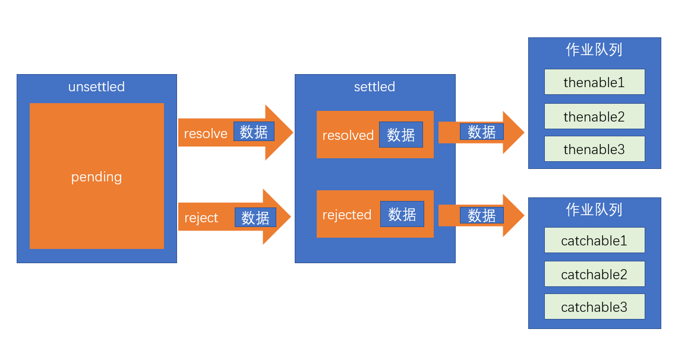

# 解构 符号 异步处理
----------
## 解构
将数组或对象的某一属性提取到变量中(可以互相嵌套使用)   
可以给结构出来的变量赋默认值（变量名 = 默认值）

### 对象解构
#### 解构剩余参数：
将剩余的所有参数都敢放到一个数组或对象中（使用展开运算符）
```javascript
const arr = [1, 2, 3, 4, 5];
let [nn1, ...arr1] = arr;
console.log(nn1, arr1)
// 将第一个结构出来，其他放到arr1 数组中
```
#### 同名解构（变量名要和属性名一致）
##### 语法：
- 先定义再解构变量：（{变量名，.....} = 对象名）
```javascript
const obj = {
    name: 'xyq',
    sex: 'male',
    age: 20,
    address: {
        province: '河南',
        city: '驻马店'
    }
}
let name, age;

({
    name,
    age
} = obj);
console.log(name, age)
```
- 直接解构 ： let / const / var  {变量名} = 对象名
```javascript
//对象解构
const obj = {
    name: 'xyq',
    sex: 'male',
    age: 20,
    address: {
        province: '河南',
        city: '驻马店'
    }
}

let {
    name,
    sex,
    age,
    address
} = obj;

console.log(t, sex, age, address)
```

#### 异名解构
{属性名：变量名}
```javascript
// 将name解构成变量t
let {
    name,
    age: t
} = obj;
console.log(name, t)
```

#### 嵌套解构
{属性名：{属性名}}
```javascript
let {
    name,
    address: {
        city
    }
} = obj;
// 此时address为 undefined
console.log(city)
```
### 数组解构
#### 模拟对象
数组可以看成特殊的对象，可以参考对象的异名解构
```javascript
const arr = [1, 2, 3, 4, 5];
let {
    0: n1,
    1: n2,
} = arr;
console.log(n1, n2);
```

#### 数组自己的结构
[变量名，，，，，变量名],按顺序结构数组，不想结构的对象用空格空出
```javascript
const arr = [1, 2, 3, 4, 5];
let [n1, n2, , n4, ] = arr;
console.log(n1, n2, n4)
```

### 参数解构
```javascript
//常用于函数参数的定义
function ajax({
    method = "get",
    url = "/"
} = {}) {
    console.log(method, url)
}
ajax()
```

## 符号
对象的属性名一定是一个字符串

### 普通符号

符号是ES6新增的一个数据类型，它通过使用函数 `Symbol(符号描述)` 来创建

符号设计的初衷，是为了给对象设置私有属性

私有属性：只能在对象内部使用，外面无法使用

符号具有以下特点：

- 没有字面量
- 使用 typeof 得到的类型是 symbol
- **每次调用 Symbol 函数得到的符号永远不相等，无论符号名是否相同**
- 符号可以作为对象的属性名存在，这种属性称之为符号属性
  - 开发者可以通过精心的设计，让这些属性无法通过常规方式被外界访问
  - 符号属性是不能枚举的，因此在 for-in 循环中无法读取到符号属性，Object.keys 方法也无法读取到符号属性
  - Object.getOwnPropertyNames 尽管可以得到所有无法枚举的属性，但是仍然无法读取到符号属性
  - ES6 新增 Object.getOwnPropertySymbols 方法，可以读取符号
- 符号无法被隐式转换，因此不能被用于数学运算、字符串拼接或其他隐式转换的场景，但符号可以显式的转换为字符串，通过 String 构造函数进行转换即可，console.log 之所以可以输出符号，是它在内部进行了显式转换

### 共享符号
根据某个符号名称（符号描述）能够得到同一个符号

```js
Symbol.for("符号名/符号描述")  //获取共享符号
```

### 知名符号
知名符号是一些具有特殊含义的共享符号，通过 Symbol 的静态属性得到

ES6 延续了 ES5 的思想：减少魔法，暴露内部实现！

因此，ES6 用知名符号暴露了某些场景的内部实现

1. Symbol.hasInstance

该符号用于定义构造函数的静态成员，它将影响 instanceof 的判定

```js

obj instanceof A

//等效于

A[Symbol.hasInstance](obj) // Function.prototype[Symbol.hasInstance]

```

2. [扩展] Symbol.isConcatSpreadable

该知名符号会影响数组的 concat 方法

3. [扩展] Symbol.toPrimitive

该知名符号会影响类型转换的结果

4. [扩展] Symbol.toStringTag

该知名符号会影响 Object.prototype.toString 的返回值

## 异步处理
### 事件循环
JS运行的环境称之为宿主环境。

#### 执行栈：
  call stack，一个数据结构，用于存放各种函数的执行环境，每一个函数执行之前，它的相关信息会加入到执行栈。函数调用之前，创建执行环境，然后加入到执行栈；函数调用之后，销毁执行环境。

JS引擎永远执行的是执行栈的最顶部。

#### 异步函数：
某些函数不会立即执行，需要等到某个时机到达后才会执行，这样的函数称之为异步函数。比如事件处理函数。异步函数的执行时机，会被宿主环境控制。

#### 浏览器宿主环境中包含5个线程：

1. JS引擎：负责执行执行栈的最顶部代码
2. GUI线程：负责渲染页面 
3. 事件监听线程：负责监听各种事件
4. 计时线程：负责计时
5. 网络线程：负责网络通信

当上面的线程发生了某些事请，如果该线程发现，这件事情有处理程序，它会将该处理程序加入一个叫做事件队列的内存。当JS引擎发现，执行栈中已经没有了任何内容后，会将事件队列中的第一个函数加入到执行栈中执行。

JS引擎对事件队列的取出执行方式，以及与宿主环境的配合，称之为事件循环。


事件队列在不同的宿主环境中有所差异，大部分宿主环境会将事件队列进行细分。在浏览器中，事件队列分为两种：

- 宏任务（队列）：macroTask，计时器结束的回调、事件回调、http回调等等绝大部分异步函数进入宏队列
- 微任务（队列）：MutationObserver，Promise产生的回调进入微队列

#### MutationObserver用于监听某个DOM对象的变化

当执行栈清空时，JS引擎首先会将微任务中的所有任务依次执行结束，如果没有微任务，则执行宏任务。

### 异步处理的通用模型

ES官方参考了大量的异步场景，总结出了一套异步的通用模型，该模型可以覆盖几乎所有的异步场景，甚至是同步场景。

值得注意的是，为了兼容旧系统，ES6 并不打算抛弃掉过去的做法，只是基于该模型推出一个全新的 API，使用该API，会让异步处理更加的简洁优雅。

理解该 API，最重要的，是理解它的异步模型

1. ES6 将某一件可能发生异步操作的事情，分为两个阶段：**unsettled** 和 **settled**


- unsettled： 未决阶段，表示事情还在进行前期的处理，并没有发生通向结果的那件事
- settled：已决阶段，事情已经有了一个结果，不管这个结果是好是坏，整件事情无法逆转

事情总是从 未决阶段 逐步发展到 已决阶段的。并且，未决阶段拥有控制何时通向已决阶段的能力。

2. ES6将事情划分为三种状态： pending、resolved、rejected

- pending: 挂起，处于未决阶段，则表示这件事情还在挂起（最终的结果还没出来）
- resolved：已处理，已决阶段的一种状态，表示整件事情已经出现结果，并是一个可以按照正常逻辑进行下去的结果
- rejected：已拒绝，已决阶段的一种状态，表示整件事情已经出现结果，并是一个无法按照正常逻辑进行下去的结果，通常用于表示有一个错误

既然未决阶段有权力决定事情的走向，因此，未决阶段可以决定事情最终的状态！

我们将 把事情变为resolved状态的过程叫做：**resolve**，推向该状态时，可能会传递一些数据

我们将 把事情变为rejected状态的过程叫做：**reject**，推向该状态时，同样可能会传递一些数据，通常为错误信息

**始终记住，无论是阶段，还是状态，是不可逆的！**


3. 当事情达到已决阶段后，通常需要进行后续处理，不同的已决状态，决定了不同的后续处理。

- resolved状态：这是一个正常的已决状态，后续处理表示为 thenable
- rejected状态：这是一个非正常的已决状态，后续处理表示为 catchable

后续处理可能有多个，因此会形成作业队列，这些后续处理会按照顺序，当状态到达后依次执行



4. 整件事称之为Promise


### Promise的基本用法

#### 格式：
```js
const pro = new Promise((resolve, reject)=>{
    // 未决阶段的处理
    // 通过调用resolve函数将Promise推向已决阶段的resolved状态
    // 通过调用reject函数将Promise推向已决阶段的rejected状态
    // resolve和reject均可以传递最多一个参数，表示推向状态的数据
})

pro.then(data=>{
    //这是thenable函数，如果当前的Promise已经是resolved状态，该函数会立即执行
    //如果当前是未决阶段，则会加入到作业队列，等待到达resolved状态后执行
    //data为状态数据
}, err=>{
    //这是catchable函数，如果当前的Promise已经是rejected状态，该函数会立即执行
    //如果当前是未决阶段，则会加入到作业队列，等待到达rejected状态后执行
    //err为状态数据
})
```

#### 细节

1. 未决阶段的处理函数是同步的，会立即执行
2. thenable和catchable函数是异步的，就算是立即执行，也会加入到事件队列中等待执行，并且，加入的队列是微队列
3. pro.then可以只添加thenable函数，pro.catch可以单独添加catchable函数
4. 在未决阶段的处理函数中，如果发生未捕获的错误，会将状态推向rejected，并会被catchable捕获
5. 一旦状态推向了已决阶段，无法再对状态做任何更改
6. **Promise并没有消除回调，只是让回调变得可控**

###  Promise的串联

当后续的Promise需要用到之前的Promise的处理结果时，需要Promise的串联

#### Promise对象中，无论是then方法还是catch方法，它们都具有返回值，返回的是一个全新的Promise对象，它的状态满足下面的规则：

1. 如果当前的Promise是未决的，得到的新的Promise是挂起状态
2. 如果当前的Promise是已决的，会运行相应的后续处理函数，并将后续处理函数的结果（返回值）作为resolved状态数据，应用到新的Promise中；如果后续处理函数发生错误，则把返回值作为rejected状态数据，应用到新的Promise中。

**后续的Promise一定会等到前面的Promise有了后续处理结果后，才会变成已决状态**

如果前面的Promise的后续处理，返回的是一个Promise，则返回的新的Promise状态和后续处理返回的Promise状态保持一致。

### Promise的其他api

#### 原型成员 (实例成员)

- then：注册一个后续处理函数，当Promise为resolved状态时运行该函数
- catch：注册一个后续处理函数，当Promise为rejected状态时运行该函数
- finally：[ES2018]注册一个后续处理函数（无参），当Promise为已决时运行该函数

#### 构造函数成员 （静态成员）

- resolve(数据)：该方法返回一个resolved状态的Promise，传递的数据作为状态数据
  - 特殊情况：如果传递的数据是Promise，则直接返回传递的Promise对象
  
- reject(数据)：该方法返回一个rejected状态的Promise，传递的数据作为状态数据

- all(iterable)：这个方法返回一个新的promise对象，该promise对象在iterable参数对象里所有的promise对象都成功的时候才会触发成功，一旦有任何一个iterable里面的promise对象失败则立即触发该promise对象的失败。这个新的promise对象在触发成功状态以后，会把一个包含iterable里所有promise返回值的数组作为成功回调的返回值，顺序跟iterable的顺序保持一致；如果这个新的promise对象触发了失败状态，它会把iterable里第一个触发失败的promise对象的错误信息作为它的失败错误信息。Promise.all方法常被用于处理多个promise对象的状态集合。

- race(iterable)：当iterable参数里的任意一个子promise被成功或失败后，父promise马上也会用子promise的成功返回值或失败详情作为参数调用父promise绑定的相应句柄，并返回该promise对象


### async 和 await

async 和 await 是 ES2016 新增两个关键字，它们借鉴了 ES2015 中生成器在实际开发中的应用，目的是简化 Promise api 的使用，并非是替代 Promise。

#### async

目的是简化在函数的返回值中对Promise的创建

async 用于修饰函数（无论是函数字面量还是函数表达式），放置在函数最开始的位置，被修饰函数的返回结果一定是 Promise 对象。

```js

async function test(){
    console.log(1);
    return 2;
}

//等效于

function test(){
    return new Promise((resolve, reject)=>{
        console.log(1);
        resolve(2);
    })
}

```

#### await

**await关键字必须出现在async函数中！！！！**

await用在某个表达式之前，如果表达式是一个Promise，则得到的是thenable中的状态数据。

```js

async function test1(){
    console.log(1);
    return 2;
}

async function test2(){
    const result = await test1();
    console.log(result);
}

test2();
```

等效于

```js

function test1(){
    return new Promise((resolve, reject)=>{
        console.log(1);
        resolve(2);
    })
}

function test2(){
    return new Promise((resolve, reject)=>{
        test1().then(data => {
            const result = data;
            console.log(result);
            resolve();
        })
    })
}

test2();

```

如果await的表达式不是Promise，则会将其使用Promise.resolve包装后按照规则运行