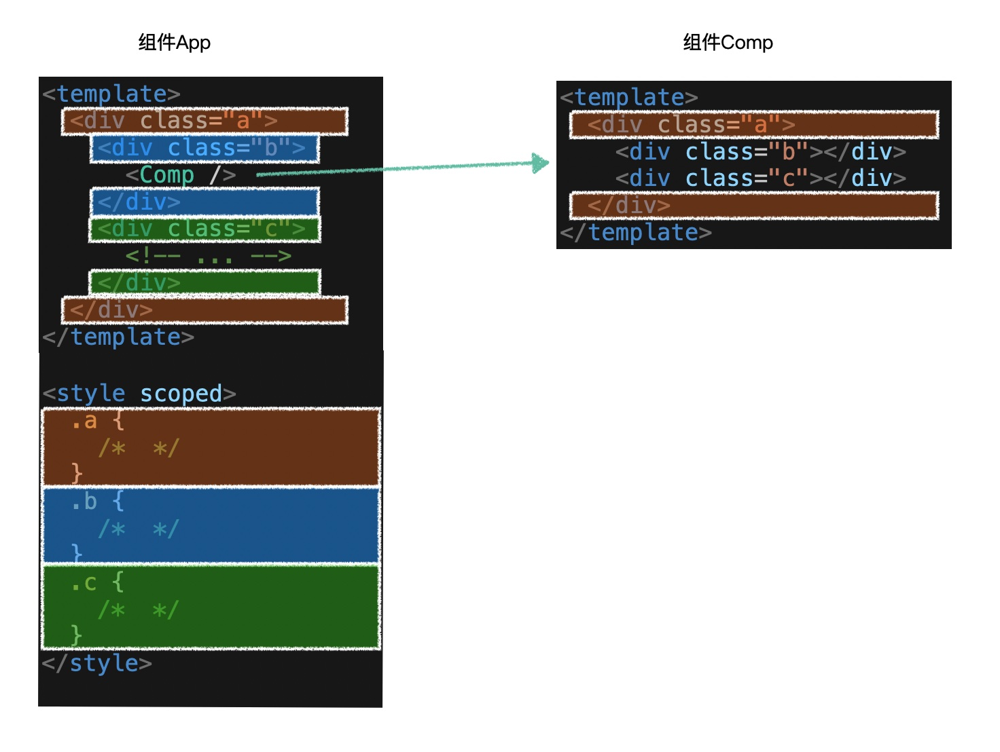

面试题：计算属性和方法有什么区别？

```
计算属性本质上是包含getter和setter的方法
当获取计算属性时，实际上是在调用计算属性的getter方法。vue会收集计算属性的依赖，并缓存计算属性的返回结果。只有当依赖变化后才会重新进行计算。
方法没有缓存，每次调用方法都会导致重新执行。
计算属性的getter和setter参数固定，getter没有参数，setter只有一个参数。而方法的参数不限。
由于有以上的这些区别，因此计算属性通常是根据已有数据得到其他数据，并在得到数据的过程中不建议使用异步、当前时间、随机数等副作用操作。
实际上，他们最重要的区别是含义上的区别。计算属性含义上也是一个数据，可以读取也可以赋值；方法含义上是一个操作，用于处理一些事情。
```


完整的计算属性书写：

```js
computed: {
  propName: {
    get(){
      // getter
    },
    set(val){
      // setter
    }
  }
}
```

只包含getter的计算属性简写：

```js
computed: {
  propName(){
    // getter
  }
}
```


父组件为影响子组件的最外层结构



