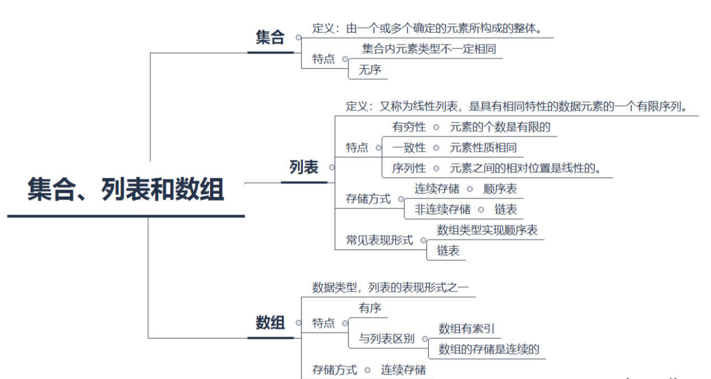

# 常用数据结构

## 数组

### 集合、列表和数组

#### 集合

**集合**一般被定义为：由一个或多个确定的元素所构成的整体

- 集合里的元素类型不一定相同。
- 集合里的元素没有顺序
image.png

#### 列表

**列表**（又称线性列表）的定义为：是一种数据项构成的有限序列，即按照一定的线性顺序，排列而成的数据项的集合。

列表的概念是在集合的特征上形成的，它具有顺序，且长度是可变的

